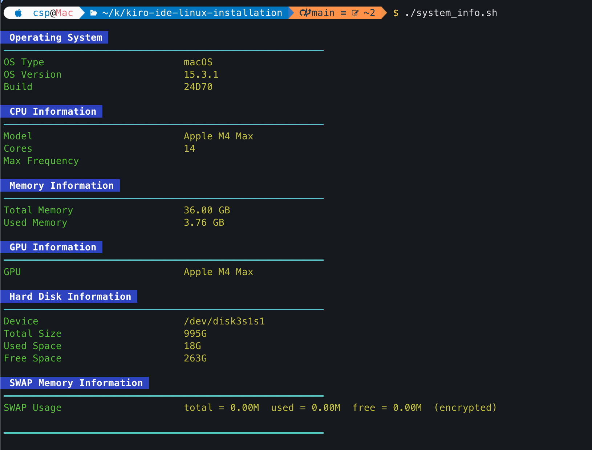

# Kiro Linux Installation

Automated installer for [Kiro](https://kiro.dev/), an AI-powered development environment. This repository provides scripts to easily install, update, and manage Kiro on any Linux distribution.

## Quick Installation

The easiest way to install Kiro is using our clone-and-install script:

```bash
curl -fsSL https://raw.githubusercontent.com/abhilashiig/kiro-ide-linux-installation/main/clone-and-install-kiro.sh | bash
```

This single command will:

- Clone this repository to a temporary directory
- Run the installation script automatically
- Clean up temporary files when done

## Installation Options

### System-wide Installation (default)

```bash
./clone-and-install-kiro.sh
```

Installs Kiro to `/opt/kiro` (requires sudo)

### User-only Installation

```bash
./clone-and-install-kiro.sh --user
```

Installs Kiro to `~/.local/share/kiro` (no sudo required)

### Force Reinstall

```bash
./clone-and-install-kiro.sh --force
```

Reinstalls even if the same version is already installed

## System Information

Check your system information (OS, CPU, memory, GPU, disk, swap) with:

```bash
curl -s https://raw.githubusercontent.com/kactlabs/kiro-ide-linux-installation/refs/heads/main/system_info.sh | bash
```
## MacOS:


This works on both macOS and Ubuntu/Linux.

## Managing Kiro

### Update Kiro

```bash
./clone-and-install-kiro.sh --update
```

The script automatically checks for updates and installs the latest version

### Uninstall Kiro

```bash
# Remove installation only
./clone-and-install-kiro.sh --uninstall

# Remove installation and user data
./clone-and-install-kiro.sh --uninstall --clean
```

## What This Does

The installation script handles everything automatically:

- Downloads the latest Kiro release
- Checks and installs required dependencies
- Sets up proper file permissions
- Creates desktop entries for easy access
- Configures system paths
- Manages version updates

## Advanced Usage

For more installation options, run:

```bash
./clone-and-install-kiro.sh --help
```

## Compatibility

Works on all major Linux distributions:

- Ubuntu/Debian
- Fedora/CentOS/RHEL
- Arch Linux
- openSUSE
- And more

## Requirements

- `git` (for cloning the repository)
- `curl` or `wget` (for downloading)
- `bash` (for running the scripts)

The installer will automatically check and install other required dependencies.

## License

This installer script is provided as-is. Kiro itself is a product of AWS and subject to its own licensing terms.
